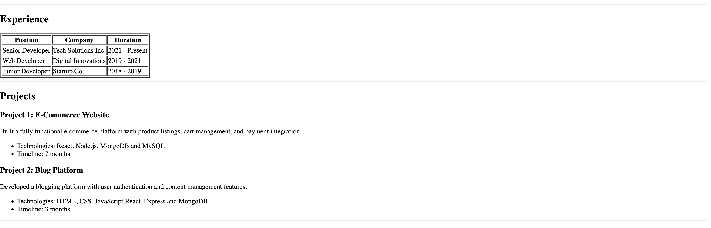

# Html-resume-Page 

# 📄 Single Page HTML Resume

A clean and semantic **single-page resume website** built using pure **HTML5**.  
This project focuses on **semantic HTML structure and how we can create a resume page with the help of the HTML **

---

## SetUp 
- First open your terminal and run the command `mkdir rusume-page` and make a directory
- Spin up the vscode and open the rusume-page directory 
- Create index.html file
- Start to write the semantic HTML code
 

## 🛠️ Technologies Used
- **HTML5**
- Semantic HTML elements

---

## 📌 Features
- Single-page layout
- Semantic HTML tags (`header`, `main`, `section`, `footer`)
- Beginner-friendly project

## To have a live Preview visit on this below link 

## Screenshots 

> Preview of the single-page HTML resume

> Preview of the every single section of HTML Resume 

